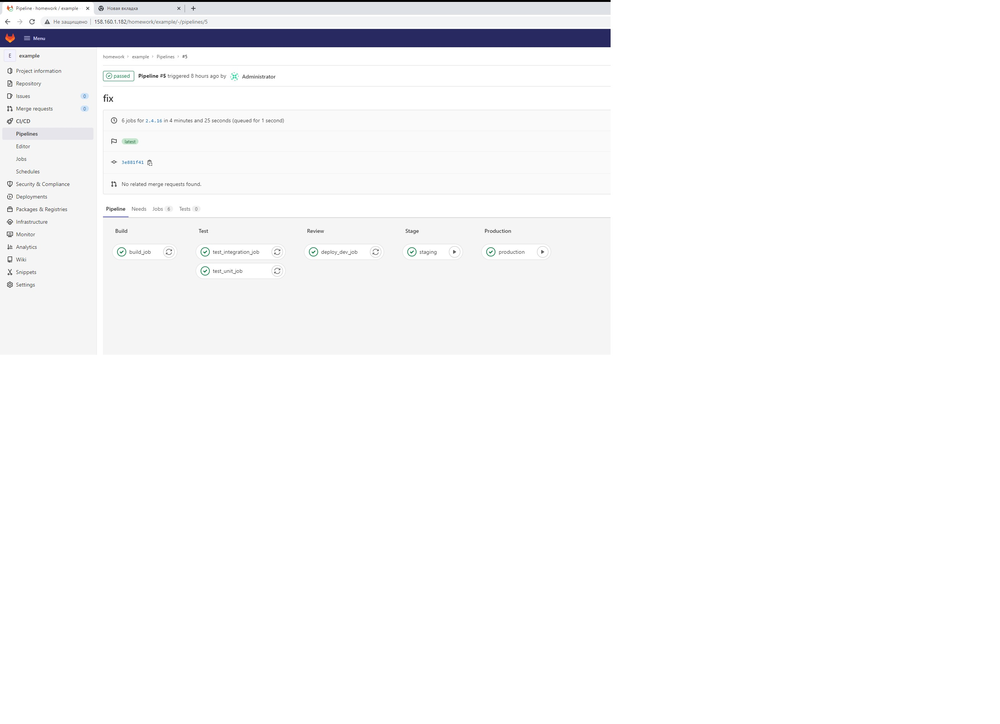

# adastraaero_microservices
adastraaero microservices repository


## Docker - 2 
Устанавливаем Docker
https://docs.docker.com/engine/install/ubuntu/


Client: Docker Engine - Community
 Cloud integration: v1.0.24
 Version:           20.10.14
 API version:       1.41
 Go version:        go1.16.15
 Git commit:        a224086
 Built:             Thu Mar 24 01:47:58 2022
 OS/Arch:           linux/amd64
 Context:           default
 Experimental:      true

Server: Docker Engine - Community
 Engine:
  Version:          20.10.14
  API version:      1.41 (minimum version 1.12)
  Go version:       go1.16.15
  Git commit:       87a90dc
  Built:            Thu Mar 24 01:45:50 2022
  OS/Arch:          linux/amd64
  Experimental:     false
 containerd:
  Version:          1.5.11
  GitCommit:        3df54a852345ae127d1fa3092b95168e4a88e2f8
 runc:
  Version:          1.0.3
  GitCommit:        v1.0.3-0-gf46b6ba
 docker-init:
  Version:          0.19.0
  GitCommit:        de40ad0
  
  
  
Устанавливаем docker machine https://github.com/docker/machine/releases


  
Создаем Docker machine


```
yc compute instance create \
  --name docker-host \
  --zone ru-central1-a \
  --network-interface subnet-name=default-ru-central1-a,nat-ip-version=ipv4 \
  --create-boot-disk image-folder-id=standard-images,image-family=ubuntu-1804-lts,size=15 \
  --ssh-key ~/.ssh/id_rsa.pub

```  
  

``` 
docker-machine create \
--driver generic \
--generic-ip-address=51.250.14.22 \
--generic-ssh-user yc-user \
--generic-ssh-key /home/mity/.ssh/id_rsa \
docker-host

```


Переключим docker на удаленный хост:


```
eval $(docker-machine env docker-host)

```

Создаем нужные файлы, собираем образ и запускаем контейнер.

```
docker build -t reddit:latest .
docker run --name reddit -d --network=host reddit:latest
```


Проверяем

docker-machine ls
NAME          ACTIVE   DRIVER    STATE     URL                       SWARM   DOCKER      ERRORS
docker-host   *        generic   Running   tcp://51.250.14.22:2376           v20.10.17


заходим через браузер и проверяем http://51.250.14.22:9292 .


### Docker hub

Отправляем образ в docker репозиторий:

```
docker login

docker tag reddit:latest adastraaero/otus-reddit:1.0
docker push adastraaero/otus-reddit:1.0
```

Проверим:

```
docker run --name reddit -d -p 9292:9292 adastraaero/otus-reddit:1.0
```

### Задания со ⭐
1. [docker-1.log](dockermonolit/docker-1.log)

## Docker - 3

Пересоздаем и запускаем dpcker host:

```
yc compute instance create \
  --name docker-host \
  --zone ru-central1-a \
  --network-interface subnet-name=default-ru-central1-a,nat-ip-version=ipv4 \
  --create-boot-disk image-folder-id=standard-images,image-family=ubuntu-1804-lts,size=15 \
  --ssh-key ~/.ssh/id_rsa.pub


docker-machine create \
--driver generic \
--generic-ip-address=51.250.74.249 \
--generic-ssh-user yc-user \
--generic-ssh-key /home/mity/.ssh/id_rsa \
docker-host

```

Переключим docker на удаленный хост:


```
eval $(docker-machine env docker-host)

```

Скачиваем архив, перемещаем файлы, добавляем в них данные. Используем для сборки Ubuntu.
Ставим и применяем hadolint на наши Dockerfiles.

Собираем приложение:

```
docker pull mongo:latest
docker build -t adastraaero/post:1.0 ./post-py
docker build -t adastraaero/comment:1.0 ./comment
docker build -t adastraaero/ui:1.0 ./ui

```

Проверяем создание образов:

```
docker images
```
Создаем и проверяем сеть для приложения

```
docker network create reddit

docker network ls 

```

Запускаем контейнеры и проверяем работу приложения.


```
docker run -d --network=reddit --network-alias=post_db --network-alias=comment_db mongo:latest
docker run -d --network=reddit --network-alias=post adastraaero/post:1.0
docker run -d --network=reddit --network-alias=comment adastraaero/comment:1.0
docker run -d --network=reddit -p 9292:9292 adastraaero/ui:1.0
```

http://51.250.74.249:9292/


## Gitlab CI Homework

Создаем ветку в репозитории:

```
git checkout -b gitlab-ci-1
```

Создаём VM на Yandex Cloud через GUI.


Устанавливаем Docker + Docler-compose

```
https://docs.docker.com/engine/install/ubuntu/
```

Подключаемся к хосту и создаём коталоги:

```
ssh yc-user@178.154.223.64
sudo mkdir -p /srv/gitlab/config /srv/gitlab/data /srv/gitlab/logs

cd /srv/gitlab
sudo touch docker-compose.yml
```

```
sudo vim docker-compose.yml

web:
  image: 'gitlab/gitlab-ce:latest'
  restart: always
  hostname: 'localhost'
  environment:
    GITLAB_OMNIBUS_CONFIG:
      external_url 'http://158.160.1.182/'
  ports:
    - '80:80'
    - '443:443'
    - '2222:22'
  volumes:
    - '/srv/gitlab/config:/etc/gitlab'
    - '/srv/gitlab/logs:/var/log/gitlab'
    - '/srv/gitlab/data:/var/opt/gitlab'
```

Запускаем gitlab:

```
sudo docker-compose up -d
```

Ждём пока службы в контейнере загрузяться и проверяем доступность:

```
http://158.160.1.182/
```


Меняем пароль от root и сохраняем значение:

```
sudo touch /srv/gitlab/config/initial_root_password

sudo cat /srv/gitlab/config/initial_root_password
```
### Настройки

1. Отключаем регистрацию новых пользователей:

```
Settings -> General -> Sign-up restrictions 

[ ] Sign-up enabled
```
2. Создаем группу: 
* Name - homework
* Description - Projects for my homework
* Visibility - private

3. Создаем проект: `example`

Для выполнения push с локального хоста в gitlab выполним (Добавление remote):

```
git remote add gitlab http://178.154.223.64/homework/example.git
git push gitlab gitlab-ci-1
```
4. Пайплайн для GitLab определяется в файле `.gitlab-ci.yml`

```
stages:
  - build
  - test
  - deploy

build_job:
  stage: build
  script:
    - echo 'Building'

test_unit_job:
  stage: test
  script:
    - echo 'Testing 1'

test_integration_job:
  stage: test
  script:
    - echo 'Testing 2'

deploy_job:
  stage: deploy
  script:
    - echo 'Deploy'
```

Запушим изменения:
```
git add .gitlab-ci.yml
git commit -m 'add pipeline definition'
git push gitlab gitlab-ci-1
```

5. Добавление раннера

На сервере Gitlab CI, выполним:

```
ssh mity@158.160.1.182/

sudo docker run -d --name gitlab-runner --restart always -v /srv/gitlabrunner/config:/etc/gitlab-runner -v /var/run/docker.sock:/var/run/docker.sock gitlab/gitlab-runner:latest
```

Регистрация раннера (указываем url сервера gitlab и токен из `Settings -> CI/CD -> Pipelines -> Runners `):

```
sudo docker exec -it gitlab-runner gitlab-runner register \
 --url http://158.160.1.182/ \
 --non-interactive \
 --locked=false \
 --name DockerRunner \
 --executor docker \
 --docker-image alpine:latest \
 --registration-token GR1348941psgUg2py7aJ5qjCfVfb6 \
 --tag-list "linux,xenial,ubuntu,docker" \
 --run-untagged
```

Если все успешно, то должен появится новый ранер в `Settings -> CI/CD -> Pipelines -> Runners ` секция `Available specific runners` и после появления ранера должен выполнится пайплайн.


6. Добавление Reddit в проект

```
git clone https://github.com/express42/reddit.git && rm -rf ./reddit/.git
git add reddit/
git commit -m "Add reddit app"
git push gitlab gitlab-ci-1
```
Измените описание пайплайна в `.gitlab-ci.yml`, создаем файл тестов `reddit/simpletest.rb`:

```
require_relative './app'
require 'test/unit'
require 'rack/test'

set :environment, :test

class MyAppTest < Test::Unit::TestCase
  include Rack::Test::Methods

  def app
    Sinatra::Application
  end

  def test_get_request
    get '/'
    assert last_response.ok?
  end
end
```

Добавим библиотеку `rack-test` в `reddit/Gemfile`:

```
gem 'rack-test'
```

Запушим код в GitLab и убедимся, что test_unit_job гоняет тесты.


7. Окружения

Добавим в `.gitlab-ci.yml` новые окружения и условия запусков для ранеров 

```
image: ruby:2.4.2

stages:
  - build
  - test
  - review
  - stage
  - production

variables:
  DATABASE_URL: 'mongodb://mongo/user_posts'
   
before_script:
  - cd reddit
  - bundle install

build_job:
  stage: build
  script:
    - echo 'Building'

test_unit_job:
  stage: test
  services:
    - mongo:latest
  script:
    - ruby simpletest.rb

test_integration_job:
  stage: test
  script:
    - echo 'Testing 2'

deploy_dev_job:
  stage: review
  script:
    - echo 'Deploy'
  environment:
    name: dev
    url: http://dev.example.com

branch review:
  stage: review
  script: echo "Deploy to $CI_ENVIRONMENT_SLUG"
  environment:
    name: branch/$CI_COMMIT_REF_NAME
    url: http://$CI_ENVIRONMENT_SLUG.example.com
  only:
    - branches
  except:
    - master

staging:
  stage: stage
  when: manual
  only:
    - /^\d+\.\d+\.\d+/
  script:
    - echo 'Deploy'
  environment:
    name: stage
    url: http://beta.example.com

production:
  stage: production
  when: manual
  only:
    - /^\d+\.\d+\.\d+/
  script:
    - echo 'Deploy'
  environment:
    name: production
    url: http://example.com

```




