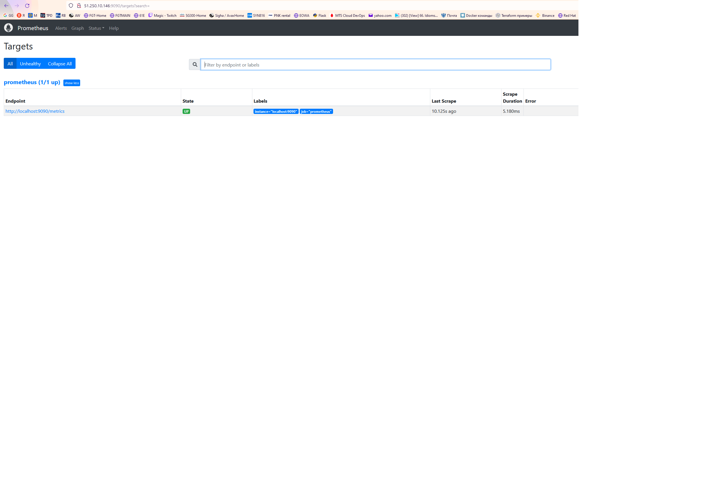
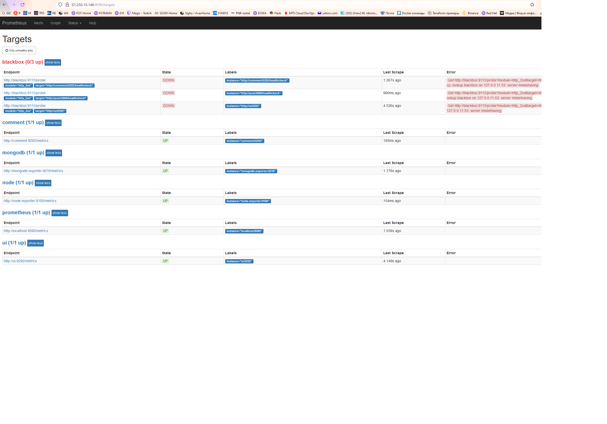
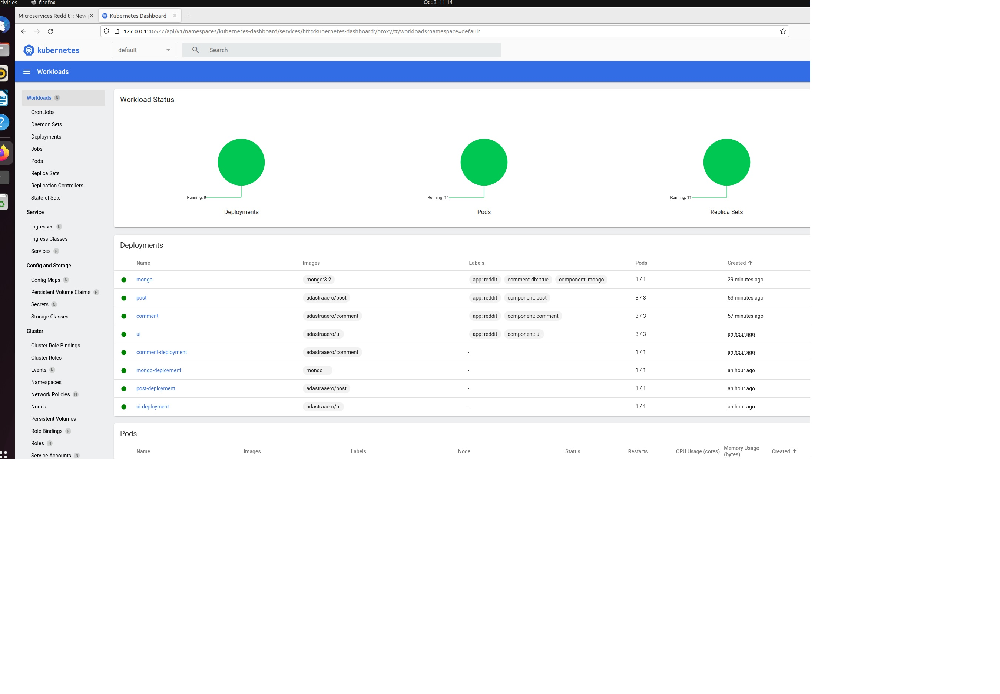

# adastraaero_microservices
adastraaero microservices repository


## Docker - 2
Устанавливаем Docker
https://docs.docker.com/engine/install/ubuntu/


Client: Docker Engine - Community
 Cloud integration: v1.0.24
 Version:           20.10.14
 API version:       1.41
 Go version:        go1.16.15
 Git commit:        a224086
 Built:             Thu Mar 24 01:47:58 2022
 OS/Arch:           linux/amd64
 Context:           default
 Experimental:      true

Server: Docker Engine - Community
 Engine:
  Version:          20.10.14
  API version:      1.41 (minimum version 1.12)
  Go version:       go1.16.15
  Git commit:       87a90dc
  Built:            Thu Mar 24 01:45:50 2022
  OS/Arch:          linux/amd64
  Experimental:     false
 containerd:
  Version:          1.5.11
  GitCommit:        3df54a852345ae127d1fa3092b95168e4a88e2f8
 runc:
  Version:          1.0.3
  GitCommit:        v1.0.3-0-gf46b6ba
 docker-init:
  Version:          0.19.0
  GitCommit:        de40ad0


Устанавливаем docker machine https://github.com/docker/machine/releases


Создаем Docker machine


```
yc compute instance create \
  --name docker-host \
  --zone ru-central1-a \
  --network-interface subnet-name=default-ru-central1-a,nat-ip-version=ipv4 \
  --create-boot-disk image-folder-id=standard-images,image-family=ubuntu-1804-lts,size=15 \
  --ssh-key ~/.ssh/id_rsa.pub

```


```
docker-machine create \
--driver generic \
--generic-ip-address=51.250.14.22 \
--generic-ssh-user yc-user \
--generic-ssh-key /home/mity/.ssh/id_rsa \
docker-host

```


Переключим docker на удаленный хост:


```
eval $(docker-machine env docker-host)

```

Создаем нужные файлы, собираем образ и запускаем контейнер.

```
docker build -t reddit:latest .
docker run --name reddit -d --network=host reddit:latest
```


Проверяем

docker-machine ls
NAME          ACTIVE   DRIVER    STATE     URL                       SWARM   DOCKER      ERRORS
docker-host   *        generic   Running   tcp://51.250.14.22:2376           v20.10.17


заходим через браузер и проверяем http://51.250.14.22:9292 .


### Docker hub

Отправляем образ в docker репозиторий:

```
docker login

docker tag reddit:latest adastraaero/otus-reddit:1.0
docker push adastraaero/otus-reddit:1.0
```

Проверим:

```
docker run --name reddit -d -p 9292:9292 adastraaero/otus-reddit:1.0
```

### Задания со ⭐
1. [docker-1.log](dockermonolit/docker-1.log)

## Docker - 3

Пересоздаем и запускаем dpcker host:

```
yc compute instance create \
  --name docker-host \
  --zone ru-central1-a \
  --network-interface subnet-name=default-ru-central1-a,nat-ip-version=ipv4 \
  --create-boot-disk image-folder-id=standard-images,image-family=ubuntu-1804-lts,size=15 \
  --ssh-key ~/.ssh/id_rsa.pub


docker-machine create \
--driver generic \
--generic-ip-address=51.250.74.249 \
--generic-ssh-user yc-user \
--generic-ssh-key /home/mity/.ssh/id_rsa \
docker-host

```

Переключим docker на удаленный хост:


```
eval $(docker-machine env docker-host)

```

Скачиваем архив, перемещаем файлы, добавляем в них данные. Используем для сборки Ubuntu.
Ставим и применяем hadolint на наши Dockerfiles.

Собираем приложение:

```
docker pull mongo:latest
docker build -t adastraaero/post:1.0 ./post-py
docker build -t adastraaero/comment:1.0 ./comment
docker build -t adastraaero/ui:1.0 ./ui

```

Проверяем создание образов:

```
docker images
```
Создаем и проверяем сеть для приложения

```
docker network create reddit

docker network ls

```

Запускаем контейнеры и проверяем работу приложения.


```
docker run -d --network=reddit --network-alias=post_db --network-alias=comment_db mongo:latest
docker run -d --network=reddit --network-alias=post adastraaero/post:1.0
docker run -d --network=reddit --network-alias=comment adastraaero/comment:1.0
docker run -d --network=reddit -p 9292:9292 adastraaero/ui:1.0
```

http://51.250.74.249:9292/


## Gitlab CI Homework

Создаем ветку в репозитории:

```
git checkout -b gitlab-ci-1
```

Создаём VM на Yandex Cloud через GUI.


Устанавливаем Docker + Docler-compose

```
https://docs.docker.com/engine/install/ubuntu/
```

Подключаемся к хосту и создаём коталоги:

```
ssh yc-user@178.154.223.64
sudo mkdir -p /srv/gitlab/config /srv/gitlab/data /srv/gitlab/logs

cd /srv/gitlab
sudo touch docker-compose.yml
```

```
sudo vim docker-compose.yml

web:
  image: 'gitlab/gitlab-ce:latest'
  restart: always
  hostname: 'localhost'
  environment:
    GITLAB_OMNIBUS_CONFIG:
      external_url 'http://158.160.1.182/'
  ports:
    - '80:80'
    - '443:443'
    - '2222:22'
  volumes:
    - '/srv/gitlab/config:/etc/gitlab'
    - '/srv/gitlab/logs:/var/log/gitlab'
    - '/srv/gitlab/data:/var/opt/gitlab'
```

Запускаем gitlab:

```
sudo docker-compose up -d
```

Ждём пока службы в контейнере загрузяться и проверяем доступность:

```
http://158.160.1.182/
```


Меняем пароль от root и сохраняем значение:

```
sudo touch /srv/gitlab/config/initial_root_password

sudo cat /srv/gitlab/config/initial_root_password
```
### Настройки

1. Отключаем регистрацию новых пользователей:

```
Settings -> General -> Sign-up restrictions

[ ] Sign-up enabled
```
2. Создаем группу:
* Name - homework
* Description - Projects for my homework
* Visibility - private

3. Создаем проект: `example`

Для выполнения push с локального хоста в gitlab выполним (Добавление remote):

```
git remote add gitlab http://178.154.223.64/homework/example.git
git push gitlab gitlab-ci-1
```
4. Пайплайн для GitLab определяется в файле `.gitlab-ci.yml`

```
stages:
  - build
  - test
  - deploy

build_job:
  stage: build
  script:
    - echo 'Building'

test_unit_job:
  stage: test
  script:
    - echo 'Testing 1'

test_integration_job:
  stage: test
  script:
    - echo 'Testing 2'

deploy_job:
  stage: deploy
  script:
    - echo 'Deploy'
```

Запушим изменения:
```
git add .gitlab-ci.yml
git commit -m 'add pipeline definition'
git push gitlab gitlab-ci-1
```

5. Добавление раннера

На сервере Gitlab CI, выполним:

```
ssh mity@158.160.1.182/

sudo docker run -d --name gitlab-runner --restart always -v /srv/gitlabrunner/config:/etc/gitlab-runner -v /var/run/docker.sock:/var/run/docker.sock gitlab/gitlab-runner:latest
```

Регистрация раннера (указываем url сервера gitlab и токен из `Settings -> CI/CD -> Pipelines -> Runners `):

```
sudo docker exec -it gitlab-runner gitlab-runner register \
 --url http://158.160.1.182/ \
 --non-interactive \
 --locked=false \
 --name DockerRunner \
 --executor docker \
 --docker-image alpine:latest \
 --registration-token GR1348941psgUg2py7aJ5qjCfVfb6 \
 --tag-list "linux,xenial,ubuntu,docker" \
 --run-untagged
```

Если все успешно, то должен появится новый ранер в `Settings -> CI/CD -> Pipelines -> Runners ` секция `Available specific runners` и после появления ранера должен выполнится пайплайн.


6. Добавление Reddit в проект

```
git clone https://github.com/express42/reddit.git && rm -rf ./reddit/.git
git add reddit/
git commit -m "Add reddit app"
git push gitlab gitlab-ci-1
```
Измените описание пайплайна в `.gitlab-ci.yml`, создаем файл тестов `reddit/simpletest.rb`:

```
require_relative './app'
require 'test/unit'
require 'rack/test'

set :environment, :test

class MyAppTest < Test::Unit::TestCase
  include Rack::Test::Methods

  def app
    Sinatra::Application
  end

  def test_get_request
    get '/'
    assert last_response.ok?
  end
end
```

Добавим библиотеку `rack-test` в `reddit/Gemfile`:

```
gem 'rack-test'
```

Запушим код в GitLab и убедимся, что test_unit_job гоняет тесты.


7. Окружения

Добавим в `.gitlab-ci.yml` новые окружения и условия запусков для ранеров

```
image: ruby:2.4.2

stages:
  - build
  - test
  - review
  - stage
  - production

variables:
  DATABASE_URL: 'mongodb://mongo/user_posts'

before_script:
  - cd reddit
  - bundle install

build_job:
  stage: build
  script:
    - echo 'Building'

test_unit_job:
  stage: test
  services:
    - mongo:latest
  script:
    - ruby simpletest.rb

test_integration_job:
  stage: test
  script:
    - echo 'Testing 2'

deploy_dev_job:
  stage: review
  script:
    - echo 'Deploy'
  environment:
    name: dev
    url: http://dev.example.com

branch review:
  stage: review
  script: echo "Deploy to $CI_ENVIRONMENT_SLUG"
  environment:
    name: branch/$CI_COMMIT_REF_NAME
    url: http://$CI_ENVIRONMENT_SLUG.example.com
  only:
    - branches
  except:
    - master

staging:
  stage: stage
  when: manual
  only:
    - /^\d+\.\d+\.\d+/
  script:
    - echo 'Deploy'
  environment:
    name: stage
    url: http://beta.example.com

production:
  stage: production
  when: manual
  only:
    - /^\d+\.\d+\.\d+/
  script:
    - echo 'Deploy'
  environment:
    name: production
    url: http://example.com

```


## Homework monitoring Prometheus
<details>
<summary>Решение</summary>


### Подготовка:

```
yc compute instance create \
  --name docker-host \
  --memory=4 \
  --zone ru-central1-a \
  --network-interface subnet-name=default-ru-central1-a,nat-ip-version=ipv4 \
  --create-boot-disk image-folder-id=standard-images,image-family=ubuntu-1804-lts,size=15 \
  --ssh-key ~/.ssh/id_rsa.pub


docker-machine create \
  --driver generic \
  --generic-ip-address=51.250.10.146 \
  --generic-ssh-user yc-user \
  --generic-ssh-key ~/.ssh/id_rsa \
  docker-host

```

```
  docker-machine ls
NAME          ACTIVE   DRIVER    STATE     URL                        SWARM   DOCKER      ERRORS
docker-host   -        generic   Running   tcp://51.250.10.146:2376           v20.10.18

```

```
 eval $(docker-machine env docker-host)

```

### Запускаем Prometheus используя готовый образ DockerHub:

```
docker run --rm -p 9090:9090 -d --name prometheus prom/prometheus

```

```
$ docker ps
CONTAINER ID   IMAGE             COMMAND                  CREATED         STATUS         PORTS                                       NAMES
bd1a4dc9973d   prom/prometheus   "/bin/prometheus --c…"   7 seconds ago   Up 4 seconds   0.0.0.0:9090->9090/tcp, :::9090->9090/tcp   prometheus

```

Проверяем: http://51.250.10.146:9090




Подготовим файловую структуру согласно задания и развернем docker-compose на docker-host

```
docker-machine ssh docker-host
sudo apt install docker-compose

```

### Создадим образ Prometheus

```

$ cat Dockerfile
FROM prom/prometheus:v2.1.0
ADD prometheus.yml /etc/prometheus/

```

prometheus.yml:

```
---
global:
  scrape_interval: '5s'

scrape_configs:
  - job_name: 'prometheus'
    static_configs:
      - targets:
        - 'localhost:9090'

  - job_name: 'ui'
    static_configs:
      - targets:
        - 'ui:9292'

  - job_name: 'comment'
    static_configs:
      - targets:
        - 'comment:9292'
```

Собираем Docker образ в директории prometheus:


```
export USER_NAME=username
docker build -t $USER_NAME/prometheus .

```

Проверяем, что появились еще endpoint:




Добавим нагрузки на Docker Host:

```
docker-machine ssh docker-host

yes > /dev/null
```


Ссылка на Dockerhub https://hub.docker.com/u/adastraaero

</details>

## Логирование и распределенная трассировка

<details>
<summary>Решение</summary>

### Готовим окружение:

```
yc compute instance create \
  --name logging \
  --memory=4 \
  --zone ru-central1-a \
  --network-interface subnet-name=default-ru-central1-a,nat-ip-version=ipv4 \
  --create-boot-disk image-folder-id=standard-images,image-family=ubuntu-1804-lts,size=15 \
  --ssh-key ~/.ssh/id_rsa.pub


docker-machine create \
  --driver generic \
  --generic-ip-address=178.154.201.3 \
  --generic-ssh-user yc-user \
  --generic-ssh-key ~/.ssh/id_rsa \
  logging

```

```
docker-machine ls
NAME      ACTIVE   DRIVER    STATE     URL                        SWARM   DOCKER      ERRORS
logging   -        generic   Running   tcp://178.154.201.3:2376           v20.10.18

```

Ставим docker-compose на docker хост:

```
docker-machine ssh logging
sudo apt install docker-compose

```

```
eval $(docker-machine env logging)
```

Собираем образы:

```
port USER_NAME='adastraaero'

cd ./src/ui && bash docker_build.sh && docker push $USER_NAME/ui:logging
cd ../post-py && bash docker_build.sh && docker push $USER_NAME/post:logging
cd ../comment && bash docker_build.sh && docker push $USER_NAME/comment:logging

```
### Elastic Stack

Система централизованного логирования на примере Elastic-стека (ранее известного как ELK), который включает в себя 3 основных компонента:
* ElasticSearch (TSDB и поисковый движок для хранения данных)
* Logstash (для аггрегации и трансформации данных)
* Kibana (для визуализации)

Для аггрегации логов вместо Logstash будем использовать Fluentd, получим еще одно популярное сочетание этих инструментов - EFK.

Fluentd - инструмент, который может использоваться для отправки, аггрегации и преобразования лог-сообщений. Fluentd будем использовать для аггрегации (сбора в одном месте) и парсинга логов сервисов нашего приложения.

В директории `logging/fluentd` создаем Dockerfile:

```
FROM fluent/fluentd:v0.12
RUN gem install faraday-net_http -v 2.1.0
RUN gem install faraday -v 1.10.2
RUN gem install fluent-plugin-elasticsearch --no-rdoc --no-ri --version 1.9.5
RUN gem install fluent-plugin-grok-parser --no-rdoc --no-ri --version 1.0.0
ADD fluent.conf /fluentd/etc
```
и файл конфигурации `logging/fluentd/fluent.conf`:

```
<source>
  @type forward
  port 24224
  bind 0.0.0.0
</source>

<match *.**>
  @type copy
  <store>
    @type elasticsearch
    host elasticsearch
    port 9200
    logstash_format true
    logstash_prefix fluentd
    logstash_dateformat %Y%m%d
    include_tag_key true
    type_name access_log
    tag_key @log_name
    flush_interval 1s
  </store>
  <store>
    @type stdout
  </store>
</match>
```

Собираем docker image для fluentd:

```
cd logging/fluentd
docker build -t $USER_NAME/fluentd .
```
### Структурированные логи

Логи должны иметь заданную (единую) структуру и содержать необходимую для нормальной эксплуатации данного сервиса информацию о его работе.

Лог-сообщения также должны иметь понятный для выбранной системы логирования формат, чтобы избежать ненужной траты ресурсов на преобразование данных в нужный вид.


Для запуска подготовленных контейнеров настроим `docker/docker-compose.yml` на теги `:logging` и запустим сервисы:

```
cd docker && docker-compose -f docker-compose.yml up -d
```

Можем посмотреть логи, например для `post` сервиса:

```
docker-compose logs -f post

Attaching to docker_post_1
post_1              | {"addr": "172.18.0.3", "event": "request", "level": "info", "method": "GET", "path": "/healthcheck?", "request_id": null, "response_status": 200, "service": "post", "timestamp": "2022-09-15 10:45:40"}
post_1              | {"addr": "172.18.0.3", "event": "request", "level": "info", "method": "GET", "path": "/healthcheck?", "request_id": null, "response_status": 200, "service": "post", "timestamp": "2022-09-15 10:45:45"}
post_1              | {"addr": "172.18.0.3", "event": "request", "level": "info", "method": "GET", "path": "/healthcheck?", "request_id": null, "response_status": 200, "service": "post", "timestamp": "2022-09-15 10:45:49"}
post_1              | {"addr": "172.18.0.3", "event": "request", "level": "info", "method": "GET", "path": "/healthcheck?", "request_id": null, "response_status": 200, "service": "post", "timestamp": "2022-09-15 10:45:55"}
post_1              | {"addr": "172.18.0.3", "event": "request", "level": "info", "method": "GET", "path": "/healthcheck?", "request_id": null, "response_status": 200, "service": "post", "timestamp": "2022-09-15 10:46:00"}
post_1              | {"addr": "172.18.0.3", "event": "request", "level": "info", "method": "GET", "path": "/healthcheck?", "request_id": null, "response_status": 200, "service": "post", "timestamp": "2022-09-15 10:46:04"}
```
Каждое событие, связанное с работой нашего приложения логируется в JSON-формате и имеет нужную нам структуру: тип события (event), сообщение (message), переданные функции параметры (params), имя сервиса (service) и др.

По умолчанию Docker-контейнерами используется json-file драйвер для логирования информации, которая пишется сервисом внутри контейнера в stdout (и stderr).

Для отправки логов во Fluentd используем docker-драйвер fluentd.

> https://docs.docker.com/config/containers/logging/fluentd/

Для сервиса post определим драйвер для логирования - `docker/docker-compose.yml`:

```
  post:
    image: ${USER_NAME}/post:logging
    environment:
      - POST_DATABASE_HOST=post_db
      - POST_DATABASE=posts
    depends_on:
      - post_db
    ports:
      - "5000:5000"
    logging:
      driver: "fluentd"
      options:
        fluentd-address: localhost:24224
        tag: service.post
```
</details>

## Kubernetes 1

<details>

### Создаем примитивы

vim kubernetes/reddit/post-deployment.yml:

```
apiVersion: apps/v1
kind: Deployment
metadata:
  name: post-deployment
spec:
  replicas: 1
  selector:
    matchLabels:
      app: post
  template:
    metadata:
      name: post
      labels:
        app: post
    spec:
      containers:
      - image: adastraaero/post
        name: post
```

Создаём в kubernetes/reddit/ файлы:

* ui-deployment.yml
* comment-deployment.yml
* mongo-deployment.yml

Создаём 2 ноды Ubuntu 18/22.04 c конфигурацией:

* RAM 4
* CPU 4
* SSD 40 GB

```
yc compute instance create \
  --name worker \
  --memory=4 \
  --cores=4 \
  --zone ru-central1-a \
  --network-interface subnet-name=default-ru-central1-a,nat-ip-version=ipv4 \
  --create-boot-disk image-folder-id=standard-images,image-family=ubuntu-1804-lts,size=40,type=network-ssd  \
  --ssh-key ~/.ssh/id_rsa.pub

```

```
yc compute instance create \
  --name master \
  --memory=4 \
  --cores=4 \
  --zone ru-central1-a \
  --network-interface subnet-name=default-ru-central1-a,nat-ip-version=ipv4 \
  --create-boot-disk image-folder-id=standard-images,image-family=ubuntu-1804-lts,size=40,type=network-ssd  \
  --ssh-key ~/.ssh/id_rsa.pub

```


ставим на данные ноды k8s - 1.19 и docker 19.03


Ставим docker - https://docs.docker.com/engine/install/ubuntu/

```
sudo apt-get update
sudo apt-get install apt-transport-https ca-certificates curl gnupg lsb-release

curl -fsSL https://download.docker.com/linux/ubuntu/gpg | sudo gpg --dearmor -o /usr/share/keyrings/docker-archive-keyring.gpg


echo "deb [arch=amd64 signed-by=/usr/share/keyrings/docker-archive-keyring.gpg] https://download.docker.com/linux/ubuntu \
$(lsb_release -cs) stable" | sudo tee /etc/apt/sources.list.d/docker.list > /dev/null

```

```
sudo apt-get update
sudo apt-get install docker-ce docker-ce-cli
```

Ставим  k8s https://kubernetes.io/docs/setup/production-environment/tools/kubeadm/install-kubeadm/

```
sudo curl -fsSLo /usr/share/keyrings/kubernetes-archive-keyring.gpg https://packages.cloud.google.com/apt/doc/apt-key.gpg
sudo echo "deb [signed-by=/usr/share/keyrings/kubernetes-archive-keyring.gpg] https://apt.kubernetes.io/ kubernetes-xenial main" | sudo tee /etc/apt/sources.list.d/kubernetes.list
sudo apt-get update
sudo apt-get install containerd.io kubelet kubeadm kubectl

```

```
sudo apt-get install docker-ce=5:19.03.15~3-0~ubuntu-bionic docker-ce-cli=5:19.03.15~3-0~ubuntu-bionic containerd.io kubelet=1.19.14-00 kubeadm=1.19.14-00 kubectl=1.19.14-00
```

выключаем swap $ sudo swapoff -a


запускаем кластер k8s:

```
kubeadm init --apiserver-cert-extra-sans=178.154.204.157--apiserver-advertise-address=0.0.0.0 --control-plane-endpoint=178.154.204.157 --pod-network-cidr=10.244.0.0/16
```

Подсоединяем ноду в кластер

sudo kubeadm join 178.154.204.157:6443 --token iikyxo.0e2rljhro1s9wetk \
    --discovery-token-ca-cert-hash sha256:f5ad5fe11063e1d52752c59fbe274b2b359bf6fad934003b56e3f436c28e8a74


Создадим конфиг файл для пользователя на мастер ноде - https://kubernetes.io/docs/setup/production-environment/tools/kubeadm/create-cluster-kubeadm/

```
mkdir $HOME/.kube/
sudo cp /etc/kubernetes/admin.conf $HOME/.kube/config
sudo chown $USER $HOME/.kube/config
```

Смотрид состояние нод:

```
kubectl get nodes
NAME       STATUS     ROLES    AGE     VERSION
hodemain   NotReady   master   18m     v1.19.14
node2      NotReady   <none>   5m34s   v1.19.14
```


```
kubectl describe node node2

Ready            False   Mon, 19 Sep 2022 17:00:21 +0000   Mon, 19 Sep 2022 16:54:51 +0000   KubeletNotReady              runtime network not ready: NetworkReady=false reason:NetworkPluginNotReady message:docker: network plugin is not ready: cni config uninitialized
```

Ноды находятся в статусе not ready, установим сетевой плагин flanel:

```
kubectl apply -f https://raw.githubusercontent.com/coreos/flannel/2140ac876ef134e0ed5af15c65e414cf26827915/Documentation/kube-flannel.yml

```

Проверим состояние нод:

```
yc-user@fhmm6l9ubd6ave5dmfjs:~$ kubectl get nodes
NAME                   STATUS   ROLES    AGE   VERSION
fhme8v4ds600b8bhucku   Ready    <none>   70s   v1.19.14
fhmm6l9ubd6ave5dmfjs   Ready    master   39m   v1.19.14
```

Запустим один из манифестов нашего приложения и убедимся, что он применяется:

```
yc-user@fhmm6l9ubd6ave5dmfjs:~$ kubectl apply -f post-deployment.yml
deployment.apps/post-deployment created
yc-user@fhmm6l9ubd6ave5dmfjs:~$ kubectl get pods
NAME                               READY   STATUS    RESTARTS   AGE
post-deployment-5877559886-bjzld   1/1     Running   0          48s

```

Удалим ресурсы:

```

yc compute instance delete worker
yc compute instance delete master

```
</details>


## Kubernetes 2


### Локальное развертывание Kubernetes

```
sudo apt-get update
sudo apt-get install -y apt-transport-https ca-certificates curl

sudo curl -fsSLo /usr/share/keyrings/kubernetes-archive-keyring.gpg https://packages.cloud.google.com/apt/doc/apt-key.gpg
echo "deb [signed-by=/usr/share/keyrings/kubernetes-archive-keyring.gpg] https://apt.kubernetes.io/ kubernetes-xenial main" | sudo tee /etc/apt/sources.list.d/kubernetes.list

sudo apt-get update
sudo apt-get install -y kubectl
```

```
kubectl cluster-info
```

**Установка Minikube**

```
curl -LO https://storage.googleapis.com/minikube/releases/latest/minikube_latest_amd64.deb
sudo dpkg -i minikube_latest_amd64.deb
```

Запустим Minikube-кластер (весрия 1.19.7):

```
minikube start --kubernetes-version 1.19.7
```

Minikube-кластер развернут. При этом автоматически был настроен конфиг kubectl.

```
kubectl get nodes

NAME       STATUS   ROLES    AGE   VERSION
minikube   Ready    master   38s   v1.19.7
```

### Локальный запуск приложения

Описываем конфигурации приложения и сервисвов в YAML манифестах в `./kubernetes/reddit`.

Запускаем minikube:


```
kubectl apply -f kubernetes/reddit/

```


```
$ minikube service ui
|-----------|------|-------------|---------------------------|
| NAMESPACE | NAME | TARGET PORT |            URL            |
|-----------|------|-------------|---------------------------|
| default   | ui   |        9292 | http://192.168.49.2:32092 |
|-----------|------|-------------|---------------------------|
🎉  Opening service default/ui in default browser...

```


**Dashboard**

Включаем аддон dashboard на minikube:

```
minikube dashboard
```
В Dashboard можно:
- Отслеживать состояние кластера и рабочих нагрузок в нем;
- Создавать новые объекты (загружать YAML-файлы);
- Удалять и изменять объекты (кол-во реплик, YAML-файлы);
- Отслеживать логи в POD-ах;
- При включении Heapster-аддона смотреть нагрузку на POD-ах;
- и т. д.c




Создаем Namespace и запускаем приложение в dev неймспейсе:

```
kubectl apply -f dev-namespace.yml

kubectl apply -n dev -f kubernetes/reddit/
```

Проверим результат:

```
minikube service ui -n dev
```

Удалим:

```
kubectl delete -n dev -f kubernetes/reddit/

```

### Yandex Cloud Managed Service for kubernetes


Создаем кластер(GUI) и группу хостов. Подключаемся к кластеру:

```
yc managed-kubernetes cluster get-credentials cat7q5uo5sno0a6coue0 --external

```


Проверяем подключение к кластеру
```
kubectl cluster-info --kubeconfig /home/mity/.kube/config
```

```
$ kubectl cluster-info --kubeconfig /home/mity/.kube/config

Kubernetes control plane is running at https://158.160.12.44
CoreDNS is running at https://158.160.12.44/api/v1/namespaces/kube-system/services/kube-dns:dns/proxy
```

Проверяем текущий контекст:

```
$ kubectl config current-context
yc-test-cluster
```

Смотрим внешние адрес нод и порт:

```
kubectl get nodes -o wide
NAME                        STATUS   ROLES    AGE     VERSION    INTERNAL-IP   EXTERNAL-IP      OS-IMAGE             KERNEL-VERSION      CONTAINER-RUNTIME
cl150dgfdj7ea2o44din-ihoq   Ready    <none>   7m17s   v1.20.11   10.129.0.6    158.160.14.185   Ubuntu 20.04.4 LTS   5.4.0-124-generic   docker://20.10.17
cl150dgfdj7ea2o44din-isil   Ready    <none>   7m26s   v1.20.11   10.129.0.24   130.193.54.96    Ubuntu 20.04.4 LTS   5.4.0-124-generic   docker://20.10.17
```

```
$ kubectl describe service ui -n dev | grep NodePort
Type:                     NodePort
NodePort:                 <unset>  32092/TCP
```

Подключаемся и делаем пост:

http://158.160.14.185:32092


